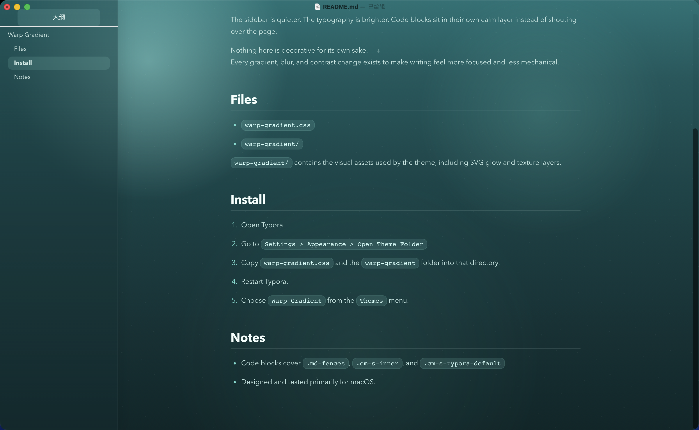

# Warp Gradient

> [English Version Below](#english-version)

Warp Gradient 是一款为 Typora 设计的暗色主题，灵感来自 Warp 那种克制、冷静、带有青绿色渐变层次的界面气质。

它不是为了做成一张“设计感很强”的皮肤，而是为了让文档在长时间阅读和书写时更安静、更清楚、更少干扰。

## 设计目标

- 只保留一个主主题，不在浅色和深色之间摇摆。
- 用上浅下深的青绿色渐变建立稳定的空间感。
- 让正文、标题、代码块和侧边栏形成统一而不过度抢眼的层级。
- 让技术写作在 Typora 里看起来更完整，而不是只有正文区域被简单换色。

## 主题特点

### 1. Warp 风格的渐变氛围

主题背景从顶部较亮的淡绿色逐步过渡到底部更深的青蓝色，保留了明显的层次，但避免了过度饱和和过度发光。

这种处理让界面有气氛，但不会压过内容本身。

### 2. 更克制的侧边栏系统

相比很多 Typora 主题里高对比的白色侧栏，Warp Gradient 把侧边栏重新压回到整体色系中：

- 保留分区感
- 降低割裂感
- 保持可读性
- 让大纲、文件列表和正文处在同一个视觉系统里

### 3. 面向长文阅读的正文排版

这套主题重点控制了几个最容易失衡的地方：

- 标题与正文对比
- 中文正文亮度
- 强调文本识别度
- 列表与引用块节奏
- 大段技术说明文的连续可读性

它更适合长时间写作，而不是短时间展示。

### 4. 独立处理的代码区域

代码部分不是普通的反色块，而是单独做了更深的面板层：

- 行内代码更像轻量标签
- 代码块拥有独立背景与边界
- 语法高亮走低噪声、高辨识度路线
- 同时覆盖 `.md-fences`、`.cm-s-inner` 和 `.cm-s-typora-default`

这样在技术文档里，代码会更稳，也更像一个完整工具的一部分。

### 5. 资源目录与完整主题结构

这个项目不只有一个 CSS 文件，还包含了主题资源目录，用于承载背景纹理和视觉资源。

这样的结构更接近一个完整主题产品，而不是单次调色结果，也更方便后续继续扩展缩略图、字体或更多 UI 资源。

## 适用场景

这套主题尤其适合：

- 技术笔记
- AI 对话整理
- 编程学习记录
- 课程总结
- 带有大量代码块的 Markdown 文档
- 希望侧边栏和正文都保持统一气质的写作场景

如果你偏好极简纯白纸张感，它可能不是最合适的选择；但如果你希望文档更有空间氛围，同时仍然保持克制，它会更合适。

## 安装方式

1. 打开 Typora。
2. 进入 `Preferences -> Appearance -> Open Theme Folder`。
3. 将以下内容复制到主题目录：

   - `warp-gradient.css`
   - `warp-gradient/`

4. 重启 Typora。
5. 在主题菜单中选择 `Warp Gradient`。

## 文件说明

- `warp-gradient.css`：主题主文件
- `warp-gradient/`：主题资源目录

## 总结

Warp Gradient 想做的不是“更花哨”，而是“更完整”。

它用更克制的渐变、更安静的侧边栏和更清楚的技术写作层级，把 Typora 调整成一个更适合长期使用的写作界面。

---

``

# Warp Gradient

Warp Gradient is a dark Typora theme inspired by the restrained green-to-teal atmosphere of Warp.

It is not designed to be flashy. It is designed to make writing feel calmer, clearer, and more deliberate over long sessions.

## Design Goals

- Keep a single primary theme instead of splitting the experience between light and dark.
- Build a stable sense of depth with a brighter green top and a deeper teal bottom.
- Create a coherent hierarchy across body text, headings, code blocks, and the sidebar.
- Treat the whole Typora interface as one product surface, not just recolor the editor area.

## Highlights

### 1. A Warp-inspired gradient atmosphere

The background starts with a softer green glow near the top and gradually falls into a deeper teal. It keeps visual depth without becoming overly saturated or theatrical.

The result is atmospheric, but still restrained.

### 2. A quieter sidebar system

Instead of using a hard, high-contrast white sidebar, Warp Gradient pulls the sidebar back into the same visual family as the editor:

- clearer separation without harsh contrast
- less visual fragmentation
- better readability
- a more unified relationship between outline, file list, and content

### 3. Typography tuned for long-form reading

The theme pays special attention to the areas most likely to break reading rhythm:

- heading-to-body contrast
- body text brightness
- emphasis visibility
- list and blockquote pacing
- sustained readability in technical prose

It is designed more for long writing sessions than for momentary visual impact.

### 4. A dedicated code layer

Code is not treated as a simple inverted block. It lives on a deeper, separate layer:

- inline code behaves like a lightweight tag
- fenced blocks have their own background and edge definition
- syntax colors are readable without becoming noisy
- the theme covers `.md-fences`, `.cm-s-inner`, and `.cm-s-typora-default`

This gives technical documents a more coherent and tool-like feel.

### 5. A complete theme structure

The project includes not only a CSS entry file, but also a resource folder for texture and visual assets.

That makes it closer to a complete theme product than a one-off recolor, and leaves room for future extension with thumbnails, fonts, or additional UI assets.

## Best Use Cases

Warp Gradient works especially well for:

- technical notes
- AI conversation archives
- programming study notes
- course summaries
- Markdown documents with many code blocks
- writing workflows where the sidebar and editor should feel visually unified

If you prefer a pure white paper-like experience, this may not be the right theme. But if you want more spatial atmosphere without losing restraint, it is a strong fit.

## Installation

1. Open Typora.
2. Go to `Preferences -> Appearance -> Open Theme Folder`.
3. Copy the following into the theme folder:

   - `warp-gradient.css`
   - `warp-gradient/`

4. Restart Typora.
5. Choose `Warp Gradient` from the Theme menu.

## Files

- `warp-gradient.css`: main theme file
- `warp-gradient/`: theme asset folder

## Summary

Warp Gradient is not trying to be louder. It is trying to be more complete.

With a restrained gradient, a quieter sidebar, and clearer hierarchy for technical writing, it turns Typora into a writing surface that feels more considered over time.

Repository:
https://github.com/folook/typora_warp_gradient_theme

Download:
https://github.com/folook/typora_warp_gradient_theme/archive/refs/heads/main.zip
