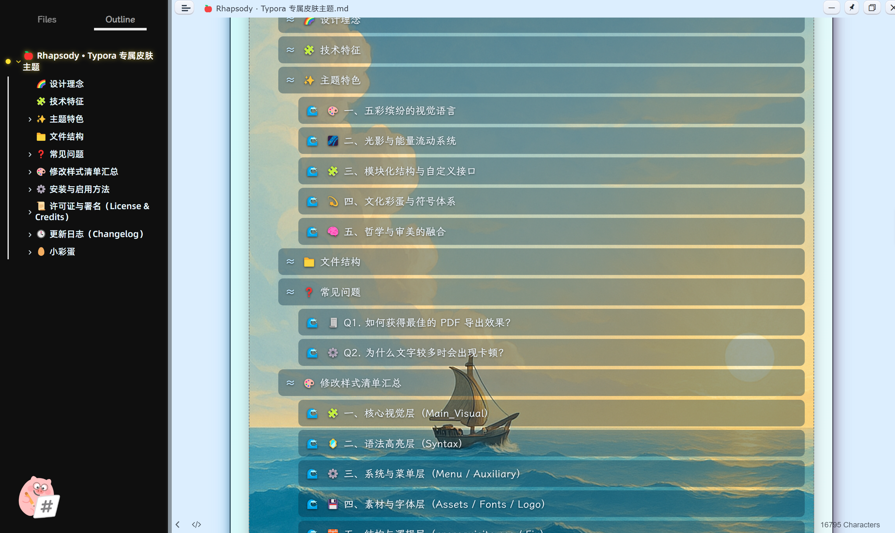
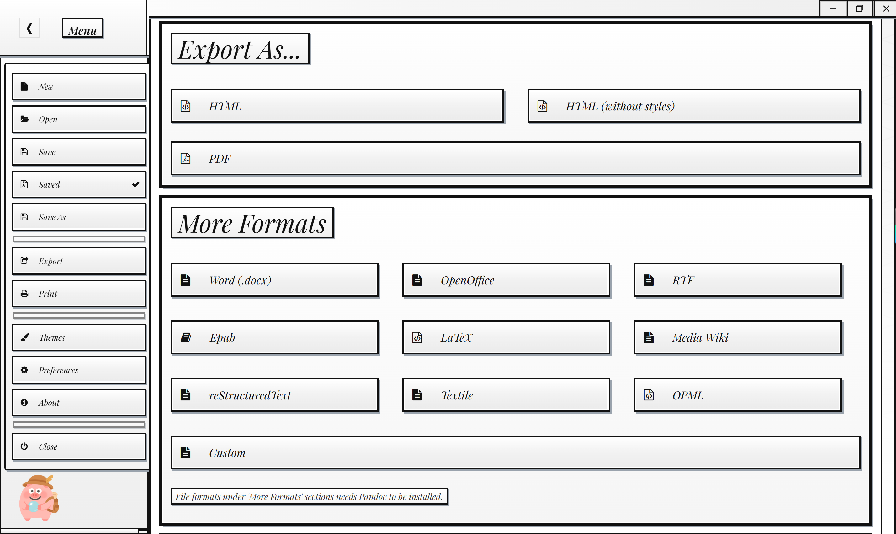
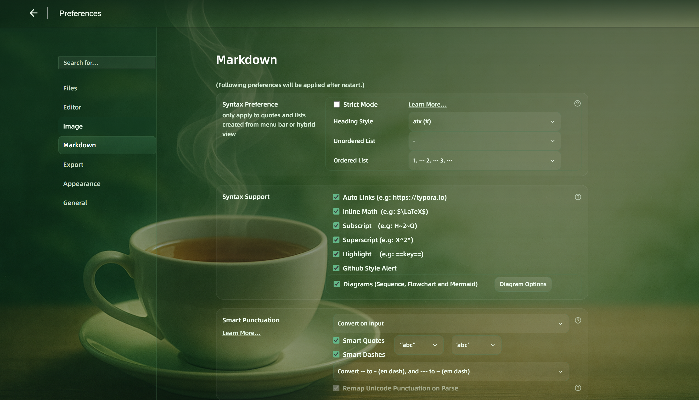

# 🍎 Rhapsody · Typora Custom Theme
> 🌐 中文版: [Rhapsody 简介](../../../_posts/theme/2025-11-01-Rhapsody.md)

> “Color is the extension of thought;  
> Writing is the symphony of order and inspiration.”

**Rhapsody** is a Typora theme designed with *color, imagination, and rhythm* as its core principles.  
It’s not just a recolor — it’s a **visual reconstruction** of Typora using **high-saturation contrasts, dynamic light layers, and multi-level headings**,  
while keeping Typora’s native HTML structure untouched for perfect compatibility.

---

## 📑 Table of Contents
- [📸 Preview](#-preview)
- [🌈 Design Philosophy](#-design-philosophy)
- [✨ Features](#-features)
- [⚙️ Installation](#️-installation)
- [📜 License & Credit](#-license--credit)

---

## 📸 Preview
> Let the colors flow, and let the words shine.

Rhapsody brings light, texture, and motion into the writing space —  
every gradient and glow reflects a dialogue between **order and inspiration**.

---

## 🌈 Design Philosophy

Rhapsody draws inspiration from the **high-saturation visual style of *Mirror’s Edge***  
and from **philosophical symbolism in color and form**.  
Its goal is not just to look “beautiful”, but to express deeper ideas:

- Colors can extend thoughts and emotions.  
- The writing space can breathe, flow, and carry energy.  
- Every visual effect is achieved purely through **CSS**, without altering Typora’s HTML structure —  
  ensuring stability, export compatibility, and long-term maintenance.

---

## ✨ Features

- 🎨 **Six-Level Heading System** — h1 adopts the signature *Appleron Lightband*, while h2–h6 feature distinct fonts and icons.  
- 💡 **Dynamic Light & Energy Layers** — Soft glows, gradient flows, and floating bubbles bring depth and vitality to your workspace.  
- 📦 **Modular CSS Architecture** — Organized into `layout.css`, `typography.css`, `math.css`, `table.css`, and `export_patch.css` for flexible customization.  
- 🧮 **Export-Friendly Patches** — Integrated fixes for HTML/PDF export to maintain consistent appearance and alignment.  
- 🧠 **Easter Egg System** — Hidden icons and animations triggered purely by CSS, adding layers of symbolic playfulness.

---

## ⚙️ Installation

1. Open Typora → Preferences → Appearance → **Open Theme Folder**  
2. Copy both **`rhapsody.css`** and the **`Rhapsody/`** resource folder into that directory.  
   (⚠️ Keep them **side by side**, not nested — the paths rely on this structure.)  
3. Restart Typora → Select **Rhapsody** from the theme list.

> ⚠️ Do **not** move `rhapsody.css` inside `Rhapsody/`.  
> Otherwise, relative paths for images and substyles will break.

---

## 📜 License & Credit

- Recommended License: **CC BY-NC-SA 4.0** *(Attribution–NonCommercial–ShareAlike)*  
- You are free to use, learn, and modify this theme for non-commercial purposes.  
- Please retain attribution when redistributing:  
  **Rhapsody Typora Theme — Designed by CGM (The Radiant Prince)**  
- For any commercial use or redistribution, please contact the author in advance.

---

For more details — including full directory tree, export configurations, and easter egg triggers —  
please visit the full documentation:  
👉 [GitHub · Rhapsody Typora Theme](https://github.com/CGMgit/Rhapsody-Typora-Theme)

